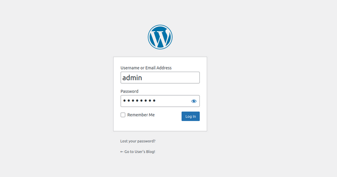
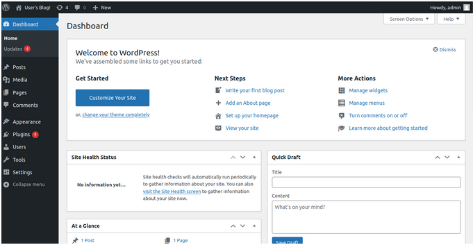
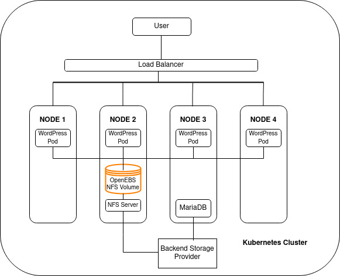

### Introduction
  In large scale environments, storage is one of the hard things to manage, and it will be the most crucial component as it has DATA with it. OpenEBS, leading open source Cloud Native Storage, makes managing storage easier in Kubernetes environments. Mayadata, the company behind the OpenEBS project, has the vision of achieving data agility by transforming Kubernetes as a data plane. This blog is mainly for users who require ReadWriteMany(RWX) for Kubernetes applications.

## OpenEBS Dynamic NFS Provisioner
  OpenEBS Dynamic NFS Provisioner will enable you to dynamically provision ReadWriteMany(RWX/MultiNode ReaderWriter) volume on any type of Kubernetes Persistent Volumes which supports dynamic provisioning,  RWX is achieved by launching NFS Server on the Persistent Volume. In simple words, dynamic-nfs-provisioner will expose ReadWriteOnce volume as ReadWriteMany volume.

**Terminology:**

| Terminology          | Meaning          |
| -------------------- | ---------------- |
| Backend StorageClass | StorageClass used by dynamic-nfs-provisioner to provision ReadWriteOnce volume(i.e Backend Volume) |
| NFS PVC              | PersistentVolumeClaim requested by the application that requires RWX volume |
| NFS PV               | PersistentVolume that bounds to NFS PVC |
| Backend PVC          | PersistentVolumeClaim created by NFS provisioner referring to Backend StorageClass during NFS PVC creation time |
| Backend PV           | PersistentVolume bounds to Backend PVC |
| ReadWriteMany(RWX)   | Volume can be accessed from different nodes at any given time |
| ReadWriteOnce(RWO)   | Volume can be accessed only from one node at any given time |

  Few workloads in Kubernetes require ReadWriteMany type of volumes, for example, WordPress, Magento, etc. In this blog, I will walk through the steps to configure WordPress with a dynamic-nfs-provisioner.


## Deploy WordPress by using dynamic NFS provisioner
  For deploying WordPress it is required to have dynamic NFS provisioner installed, So let’s first install dynamic NFS provisioner and then WordPress application.

### Prerequisites for deploying dynamic NFS provisioner
- Minimum Kuberentes Version 1.18
- NFS Client must be installed on all nodes where the application pod schedules.
  For Ubuntu/Debian run below command to install nfs client:
  ```sh
  sudo apt install nfs-common
  ```
- Storage provider(supports dynamic provisioning) to serve backend volume claim requests. In this blog, we are going to use OpenEBS localpv-hostpath as a backend storage provider.

### Install NFS Provisioner
  NFS provisioner will dynamically provision NFS volumes, install NFS provisioner using below helm commands and it will deploy NFS provisioner with basic configurations, NFS provisioner also accepts [values.yaml](https://github.com/openebs/dynamic-nfs-provisioner/tree/develop/deploy/helm/charts#configuration)

  - To install NFS provisioner add repository and then install nfs-provisioner

    #### Add OpenEBS repo for installation
    - Use the below command to add helm repo for OpenEBS

          $ helm repo add openebs https://openebs.github.io/charts
    - Once repo has been added successfully, update helm repo using the following command:

          $ helm repo update

    #### Installing OpenEBS NFS Provisioner
      Once the helm repo addition is successful, run the `helm install` command as specified below, in this command, we are disabling the local-pv provisioner which doesn’t require for NFS Provisioner to work and configure __.nfsStorageClass.backendStorageClass__ corresponding to backend StorageProvider

      ```sh
      helm install openebs openebs/openebs -n openebs --create-namespace \
        --set legacy.enabled=false \
        --set ndm.enabled=false \
        --set ndmOperator.enabled=false \
        --set localProvisioner.enabled=false \
        --set nfs-provisioner.enabled=true \
        --set nfs-provisioner.nfsStorageClass.backendStorageClass=<backend_sc_name>
      ```
      - After successful helm installation, you can view the __openebs-nfs-provisioner__ and __openebs-kernel-nfs__ StorageClass will get deployed.

        **Output**:
        ```sh
        [develop@develop ~]$ kubectl get po -n openebs
        NAME                                           READY   STATUS    RESTARTS   AGE
        openebs-nfs-provisioner-79b6ccd59-v8p6s        1/1     Running   0          4m12s

        [develop@develop~]$ kubectl get sc
        NAME                 PROVISIONER         RECLAIMPOLICY   VOLUMEBINDINGMODE      ALLOWVOLUMEEXPANSION   AGE
        openebs-kernel-nfs   openebs.io/nfsrwx   Delete          Immediate              false                  67s
        ```

     **Optional(installation of local-pv-provisioner)**
        The below command will install OpenEBS local-pv provisioner along with NFS  provisioner, as stated above local-pv is used as backend StorageProvider in this blog

        ```sh
        helm install openebs openebs/openebs -n openebs --create-namespace \
          --set legacy.enabled=false \
          --set ndm.enabled=false \
          --set ndmOperator.enabled=false \
          --set localProvisioner.enabled=true \
          --set localProvisioner.hostpathClass.name=openebs-hostpath \
          --set localprovisioner.basePath=/var/openebs/hostpath \
          --set nfs-provisioner.enabled=true  \
          --set nfs-provisioner.nfsStorageClass.backendStorageClass=openebs-hostpath
        ```

        **Note**: `localprovisioner.basePath` defines the custom hostpath directory to provide storage for backend PVCs.

### Install WordPress

  [WordPress](https://en.wikipedia.org/wiki/WordPress) is one of the most famous blogging platforms and also it is bloggers first choice because of it's easy to handle nature. One can dynamically scale web servers of WordPress(content management systems [CMS]) by making use of Horizontal Pod Autoscaler feature of Kubernetes i.e increasing load will automatically scale the wordpress pods, users can install WordPress in multiple ways, but in this blog, we are going to install from its Helm repository by using [MariaDB](https://en.wikipedia.org/wiki/MariaDB) server to satisfy the requirements of WordPress server.

  #### Add helm repo for WordPress

  - Use the below command to add helm repo for WordPress
    ```sh
    helm repo add bitnami https://charts.bitnami.com/bitnami
    ```
  - Once repo has been added successfully, update helm repo using the following command
    ```sh
    helm repo update
    ```

  #### Installing WordPress
  Once the repo has been updated successfully, we can install WordPress referring to dynamic NFS provisioner storageclass. In this case storageclass will be openebs-kernel-nfs, if you have different storageclass then update the value of --set persistence.storageClass accordingly. WordPress also accepts various other parameters, for more information click [here](https://github.com/bitnami/charts/tree/master/bitnami/wordpress#parameters)

  ```sh
  helm install my-release -n wordpress --create-namespace \
    --set wordpressUsername=admin \
    --set wordpressPassword=password \
    --set mariadb.auth.rootPassword=secretpassword \
    --set mariadb.primary.persistence.enabled=true \
    --set mariadb.primary.persistence.storageClass=openebs-hostpath \
    --set mariadb.primary.persistence.accessModes={ReadWriteOnce} \
    --set persistence.storageClass=openebs-kernel-nfs \
    --set persistence.accessModes={ReadWriteMany} \
    --set volumePermissions.enabled=true \
    --set autoscaling.enabled=true \
    --set autoscaling.minReplicas=2 \
    --set autoscaling.maxReplicas=6 \
    --set autoscaling.targetCPU=80 \
    bitnami/wordpress
  ```

  Above helm installation should create following resources in the cluster:

  - Two WordPress application pod instances with RWX persistent volume.
  - One Mariadb application pod instance with RWO persistent volume.

  Results of helm wordpress installation:
  ```sh
  kubectl get po -n wordpress
  NAME                                    READY   STATUS    RESTARTS   AGE
  my-release-mariadb-0                    1/1     Running   0          2m34s
  my-release-wordpress-85dc688bb9-24jx2   1/1     Running   0          2m34s
  my-release-wordpress-85dc688bb9-wkfpd   1/1     Running   1          2m18s
  ```

  Once the installation process is succeeded, follow the steps mentioned in output of _helm install_ command to access WordPress from your browser:

  

  Now it's time to hack WordPress:

  

**Deployment View**:

  


  **Background details on how NFS provisioner on provisioning RWX volume:**

  Once the PersistentVolumeClaim is created by referring to NFS provisioner storageclass, NFS provisioner will process the volume request and perform following actions:
  - Create Backend PVC and wait till the backend storage provider provides a volume.
  - Create NFS server deployment on backend PVC to expose RWO volumes as RWX volume via kernel NFS service.
  - Create NFS server kubernetes service which helps for other services to communicate with NFS server.
  - Create PersistentVolume(PV) for requested PersistentVolumeClaim.

  View of resources created after provisioning volume:

  ```sh
  kubectl get all -n openebs

  NAME                                                                READY   STATUS    RESTARTS   AGE
  pod/nfs-pvc-4ca805a6-6bd2-46cd-a845-d2aee2562323-57645d68f8-hrvvm   1/1     Running   0          12m
    
  NAME                                                   TYPE        CLUSTER-IP       EXTERNAL-IP   PORT(S)            AGE
  service/nfs-pvc-4ca805a6-6bd2-46cd-a845-d2aee2562323   ClusterIP   10.100.164.113   <none>        2049/TCP,111/TCP   12m
    
  NAME                                                           READY   UP-TO-DATE   AVAILABLE   AGE
  deployment.apps/nfs-pvc-4ca805a6-6bd2-46cd-a845-d2aee2562323   1/1     1            1           12m
    
  kubectl get pvc -n openebs
  NAME                                           STATUS   VOLUME                                     CAPACITY   ACCESS MODES   STORAGECLASS       AGE
    nfs-pvc-4ca805a6-6bd2-46cd-a845-d2aee2562323   Bound    pvc-4bde2312-15a6-4b06-a309-069b47ce569c   10Gi       RWO            openebs-hostpath   14m
  ```

### Benefits of using dynamic NFS Provisioner
  Dynamic NFS provisioner has various advantages, few of them are:
  - Provides configurable options to reduce recovery times(i.e maintaining HighAvailability of server)
    - **LeaseTime**: Lease time defines the renewal period(in seconds) for client connection.
    - **GraceTime**: Grace time defines the recovery period(in seconds) to reclaim locks.

    Recovery options can be configured via StorageClass annotations:
        
    ```yaml
    apiVersion: storage.k8s.io/v1
    kind: StorageClass
    metadata:
      name: openebs-rwx
      annotations:
        openebs.io/cas-type: nfsrwx
        cas.openebs.io/config: |
        #  LeaseTime defines the renewal period(in seconds) for client state
        - name: LeaseTime
          value: 30
        #  GraceTime defines the recovery period(in seconds) to reclaim locks
        - name: GraceTime
          value: 30
    ...
    ...
    ...
    ```
  - Provides options to launch an NFS server on a specific set of nodes by using [node-affinity](https://github.com/openebs/dynamic-nfs-provisioner/blob/develop/docs/tutorial/node-affinity.md#nfs-server-node-affinity) feature.
  - Supports [manual](https://github.com/openebs/dynamic-nfs-provisioner/blob/develop/docs/tutorial/nfs-volume-resize.md) expansion of NFS(RWX) volume, for automation please track issue [#37](https://github.com/openebs/dynamic-nfs-provisioner/issues/37).
  - Provides an option to make NFS volume available only for [specific set of applications](https://github.com/openebs/dynamic-nfs-provisioner/blob/develop/docs/troubleshooting/non-root-application-accesing-nfs-volume.md#intro) which has matching permissions.
